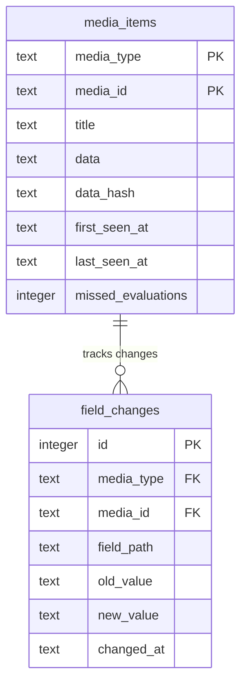

# Migrate Persistence Layer to Drizzle ORM

## Enhancement Summary

**Deepened on:** 2026-02-15
**Review agents used:** 11 (TypeScript Reviewer, Architecture Strategist, Data Migration Expert, Data Integrity Guardian, Performance Oracle, Security Sentinel, Code Simplicity Reviewer, Pattern Recognition Specialist, Best Practices Researcher, Repo Research Analyst, Deployment Verification Agent)
**Documentation sources:** Context7 (Drizzle ORM), SQLite documentation

### Key Improvements

1. **New `(field_path, changed_at DESC)` index** — the batch state query's `WHERE field_path IN (...)` clause cannot use the existing `(media_type, media_id, field_path)` index efficiently; a dedicated index is critical for performance
2. **Bridge migration hardened** — transaction wrapping, FK toggle protocol, `NOT NULL DEFAULT` on `ADD COLUMN`, table-existence guards, pre-migration backup, verification queries, and rollback plan
3. **Multi-row batch inserts** — replace per-item upsert loops with `db.insert().values([...batch])` to preserve prepared statement reuse and stay under SQLite's 999 parameter limit
4. **Drizzle journal seeding specified** — read hash from generated migration metadata file rather than computing manually
5. **Explicit `changedAt` in all inserts** — schema has no DB-level default; application code must always supply this value

### New Considerations Discovered

- `PRAGMA foreign_keys` must be OFF during bridge migration (DDL + DML mix), then re-enabled with `PRAGMA foreign_key_check` verification after
- `last_seen_at` `ADD COLUMN` needs `NOT NULL DEFAULT ''` to prevent transient NULLs before the UPDATE backfill
- Bridge migration must guard for already-bridged databases (check table existence, not just `user_version`)
- SQLite file should be backed up before bridge migration — no other rollback path
- `JSON.parse` on the `data` column should be wrapped in try-catch at the boundary
- Consider `noFloatingPromises` lint rule to catch missing `await` on async `snapshot()`

---

## Overview

Replace the raw `bun:sqlite` persistence layer with Drizzle ORM (`drizzle-orm/bun-sqlite`) while preserving the two-table model (`media_items` + `field_changes`), improving state computation to be data-driven and batch-oriented, and removing the 90-day retention limit on change history. The migration must safely upgrade existing v1 databases without data loss.

## Problem Statement

The current persistence layer uses raw SQL strings with `bun:sqlite`, manual `PRAGMA user_version` migrations, and hardcoded state computation methods. While functional, this approach lacks type safety in queries, requires bespoke mining methods for each temporal field, uses N+1 queries for state enrichment, and has a 90-day retention window that can silently break long-lookback rules. As an open-source project, the state computation must be extensible without requiring contributors to write custom SQL mining methods.

## Proposed Solution

Migrate to Drizzle ORM with four key improvements:

1. **Type-safe schema and queries** via Drizzle's SQLite schema definitions and query builder
2. **Data-driven state computation** via a temporal field registry with pluggable computation patterns
3. **Batch state queries** replacing the N+1 pattern with a single query + in-memory indexing
4. **Unbounded change history** by removing the 90-day retention policy

## Technical Approach

### Architecture

```
DatabaseModule (@Global)
└─ DatabaseService
   ├─ Creates bun:sqlite Database instance
   ├─ Passes to drizzle({ client: sqlite }) for Drizzle instance
   ├─ Configures PRAGMAs on raw driver (before Drizzle wraps it)
   ├─ Runs bridge migration for v1 databases
   ├─ Runs drizzle-kit migrations
   └─ Exposes getDrizzle(): BunSQLiteDatabase

SnapshotModule
├─ SnapshotService (rewritten with Drizzle queries, now async)
├─ StateService (refactored to registry-based batch computation)
└─ exports: [SnapshotService, StateService]
```

### Schema (Drizzle definitions)

**`src/database/schema.ts`**

```typescript
import { foreignKey, index, integer, primaryKey, sqliteTable, text } from "drizzle-orm/sqlite-core";

export const mediaItems = sqliteTable("media_items", {
  mediaType: text("media_type").notNull(),
  mediaId: text("media_id").notNull(),
  title: text("title").notNull(),
  data: text("data").notNull(),
  dataHash: text("data_hash").notNull(),
  firstSeenAt: text("first_seen_at").notNull(),
  lastSeenAt: text("last_seen_at").notNull(),
  missedEvaluations: integer("missed_evaluations").notNull().default(0),
}, (table) => [
  primaryKey({ columns: [table.mediaType, table.mediaId] }),
]);

export const fieldChanges = sqliteTable("field_changes", {
  id: integer("id").primaryKey({ autoIncrement: true }),
  mediaType: text("media_type").notNull(),
  mediaId: text("media_id").notNull(),
  fieldPath: text("field_path").notNull(),
  oldValue: text("old_value"),
  newValue: text("new_value"),
  changedAt: text("changed_at").notNull(),
}, (table) => [
  index("idx_field_changes_lookup").on(table.mediaType, table.mediaId, table.fieldPath),
  index("idx_field_changes_state").on(table.fieldPath, table.changedAt),
  foreignKey({
    columns: [table.mediaType, table.mediaId],
    foreignColumns: [mediaItems.mediaType, mediaItems.mediaId],
  }).onDelete("cascade"),
]);
```

### Research Insights — Schema

**New index `idx_field_changes_state`:**
The batch state query in Phase 4 uses `WHERE field_path IN (...) ORDER BY changed_at DESC`. The existing `(media_type, media_id, field_path)` index has `field_path` as the third column, so it cannot serve as a prefix for `field_path IN (...)` lookups. A dedicated `(field_path, changed_at)` index enables index-only scans for the state computation query. Without this, performance degrades linearly with table size.

**Composite FK with CASCADE:**
Context7 docs confirm Drizzle's composite FK with `.onDelete("cascade")` generates correct SQLite DDL. CASCADE will automatically clean up `field_changes` rows when a `media_items` row is deleted by orphan cleanup.

**`changedAt` has no DB default:**
The schema intentionally omits a default for `changedAt`. All application code inserting into `fieldChanges` must explicitly supply `changedAt: new Date().toISOString()`. This is a deliberate choice — the application controls the timestamp, not the database.

ERD:



### Implementation Phases

#### Phase 1: Drizzle Setup and Schema Definition

Install dependencies, define the Drizzle schema, configure drizzle-kit, and add necessary Biome overrides.

**Tasks:**

- [x] Install `drizzle-orm` and `drizzle-kit` — `bun add drizzle-orm && bun add -d drizzle-kit`
- [x] Create `src/database/schema.ts` with `mediaItems` and `fieldChanges` table definitions (include `idx_field_changes_state` index)
- [x] Create `drizzle.config.ts` at project root with `dialect: 'sqlite'`, `schema: './src/database/schema.ts'`, `out: './drizzle'`
- [x] Add Biome override for `drizzle.config.ts` to allow default export (matches existing `lint-staged.config.ts` override pattern at `biome.json:63-73`)
- [x] Run `bunx drizzle-kit generate` to produce the initial migration SQL
- [x] Verify generated SQL matches expected DDL (composite PK, both indexes, column types)
- [x] Save the generated migration hash/metadata — needed for bridge journal seeding in Phase 2
- [x] Add `drizzle/` to the Docker COPY in `Dockerfile`

**Files:**

- `src/database/schema.ts` (new)
- `drizzle.config.ts` (new)
- `drizzle/` (new, generated)
- `biome.json` (edit — add override)
- `package.json` (edit — new deps)
- `Dockerfile` (edit — copy migrations)

### Research Insights — Phase 1

**drizzle.config.ts format:**
Per Context7 docs, the config uses `defineConfig` from `drizzle-kit`:

```typescript
import { defineConfig } from "drizzle-kit";

export default defineConfig({
  dialect: "sqlite",
  schema: "./src/database/schema.ts",
  out: "./drizzle",
});
```

**Generated migration metadata:**
After `drizzle-kit generate`, the `drizzle/meta/` directory will contain a `_journal.json` file with the migration hash and timestamp. This is the source of truth for bridge journal seeding — do not compute the hash manually.

**Dockerfile consideration:**
The `COPY drizzle/ ./drizzle/` line should be placed after `COPY package.json bun.lock ./` but before `RUN bun install` to leverage Docker layer caching. Migration SQL files change less frequently than source code.

---

#### Phase 2: DatabaseService Migration

Replace the raw `bun:sqlite` wrapper with a Drizzle-managed instance. Handle the v1 bridge migration for upgrading users.

**Tasks:**

- [x] Rewrite `DatabaseService` to create `bun:sqlite` Database, configure PRAGMAs on it, then wrap with `drizzle({ client: sqlite })`
- [x] Configure PRAGMAs in this order: `foreign_keys=ON` first, then `journal_mode=WAL`, `synchronous=NORMAL`, `busy_timeout=5000`
- [x] Verify PRAGMA application: `PRAGMA foreign_keys` should return `1` — log a warning if it doesn't
- [x] Add `getDrizzle()` method returning the typed Drizzle instance
- [x] Keep `getDatabase()` until Phases 3-4 migrate all consumers, then remove it in Phase 5 cleanup
- [x] Implement v1 bridge migration (see "V1 Bridge Migration Strategy" below)
- [x] Replace manual `PRAGMA user_version` system with Drizzle's programmatic `migrate()` API (imported from `drizzle-orm/bun-sqlite/migrator`) called in `onModuleInit`, pointing at the `drizzle/` directory
- [x] Update `DatabaseModule` to export the Drizzle instance
- [x] Update `database.service.test.ts` — test fresh init, v1 upgrade, already-bridged re-init, and idempotent re-init

**V1 Bridge Migration Strategy:**

Before running drizzle-kit migrations, check for a pre-existing v1 database:

```
1. BACKUP: Copy the SQLite file to <path>.backup before any changes
2. Check PRAGMA user_version
3. If user_version >= 1 (v1 database exists):
   a. Verify media_snapshots table exists (guard against partial bridge)
   b. PRAGMA foreign_keys = OFF  (required: DDL + DML in same transaction)
   c. BEGIN TRANSACTION
   d. ALTER TABLE media_snapshots RENAME TO media_items
   e. ALTER TABLE media_items ADD COLUMN last_seen_at TEXT NOT NULL DEFAULT ''
   f. UPDATE media_items SET last_seen_at = last_updated_at
   g. ALTER TABLE media_items DROP COLUMN last_updated_at
      (SQLite 3.35+, which Bun bundles, supports DROP COLUMN)
   h. DROP INDEX IF EXISTS idx_field_changes_cleanup
      (no longer needed — retention removed)
   i. CREATE INDEX IF NOT EXISTS idx_field_changes_state
      ON field_changes (field_path, changed_at)
   j. Set PRAGMA user_version = 0
      (reset so it doesn't conflict with drizzle-kit journal)
   k. Seed the drizzle __drizzle_migrations journal table:
      - Read hash + timestamp from drizzle/meta/_journal.json
      - INSERT INTO __drizzle_migrations (hash, created_at) VALUES (?, ?)
   l. COMMIT
   m. PRAGMA foreign_keys = ON
   n. PRAGMA foreign_key_check  (verify FK integrity post-migration)
4. If user_version >= 1 but media_snapshots does NOT exist:
   a. Database was already bridged (media_items exists) — skip to step 3k
      to ensure journal is seeded, then proceed
5. If user_version = 0 and no tables exist (fresh install):
   a. drizzle-kit migrate handles everything
```

### Research Insights — V1 Bridge Migration

**Critical: FK toggle protocol:**
SQLite requires `PRAGMA foreign_keys = OFF` before any DDL that modifies tables referenced by foreign keys. The bridge migration renames `media_snapshots` (which `field_changes` references), so FKs must be off during the transaction. After committing, re-enable with `PRAGMA foreign_keys = ON` and verify with `PRAGMA foreign_key_check` — this returns rows for any broken FK references.

**Critical: `NOT NULL DEFAULT ''` on ADD COLUMN:**
SQLite's `ADD COLUMN` with `NOT NULL` requires a `DEFAULT` value. Using `ADD COLUMN last_seen_at TEXT NOT NULL DEFAULT ''` prevents transient NULL rows. The subsequent UPDATE immediately backfills with real data. Without the DEFAULT, `ADD COLUMN ... NOT NULL` will fail.

**Guard for already-bridged databases:**
A user might restart the app after a partial bridge (crash between steps). Checking only `user_version` is insufficient — also check whether `media_snapshots` vs `media_items` exists. If `media_items` already exists but the journal isn't seeded, just seed the journal and proceed.

**Journal seeding — read from generated metadata:**
After `drizzle-kit generate`, the file `drizzle/meta/_journal.json` contains entries like:
```json
{ "entries": [{ "idx": 0, "version": "7", "when": 1739577600000, "tag": "0000_...", "breakpoints": true }] }
```
Read the `tag` (which is the hash) and `when` (timestamp) from this file. Do NOT compute the hash manually — drizzle-kit's internal hashing algorithm is an implementation detail.

**Backup before bridge:**
SQLite is a single file. Copy it before the bridge starts. If anything goes wrong, restore from backup. This is the only reliable rollback mechanism for SQLite schema changes.

**Verification queries (add to tests):**
```sql
-- After bridge, verify:
SELECT count(*) FROM media_items;                    -- should match pre-bridge count
SELECT count(*) FROM field_changes;                  -- unchanged
PRAGMA foreign_key_check;                            -- should return empty (no violations)
SELECT count(*) FROM media_items WHERE last_seen_at = '';  -- should be 0 after backfill
SELECT count(*) FROM __drizzle_migrations;           -- should be 1
```

**Rollback plan:**
If bridge fails mid-transaction: SQLite rolls back automatically. If bridge succeeds but app has issues: restore from `.backup` file. Document this in logs: `"Bridge migration complete. Backup at: <path>.backup"`.

> **Note on FK after rename:** SQLite automatically updates FK references when a table is renamed via `ALTER TABLE ... RENAME TO`. The `field_changes` FK pointing at `media_snapshots` will automatically point at `media_items`. No need to recreate the table.

**Files:**

- `src/database/database.service.ts` (rewrite)
- `src/database/database.module.ts` (edit — update exports)
- `src/database/database.service.test.ts` (rewrite)

---

#### Phase 3: SnapshotService Migration

Rewrite all raw SQL in `SnapshotService` to use Drizzle's query builder. Remove the 90-day retention cleanup. Make `snapshot()` async.

**Tasks:**

- [x] Replace `private db!: Database` with Drizzle instance from `DatabaseService.getDrizzle()`
- [x] Rewrite `loadAllSnapshots()` using `db.select().from(mediaItems)`
- [x] Rewrite upsert logic using Drizzle's `db.insert(mediaItems).values(...).onConflictDoUpdate(...)` with multi-row batching
- [x] Rewrite field change inserts using `db.insert(fieldChanges).values([...batch])` (multi-row)
- [x] Rewrite `incrementMissedEvaluations()` using Drizzle's `db.update(mediaItems).set(...).where(...)`
- [x] Rewrite `cleanupOrphans()` using `db.delete(mediaItems).where(gt(mediaItems.missedEvaluations, ORPHAN_GRACE_EVALUATIONS))`
- [x] Remove `cleanupExpiredChanges()` entirely (no retention)
- [x] Remove `CHANGE_RETENTION_DAYS` and `RETENTION_CLEANUP_BATCH` constants
- [x] Make `snapshot()` async (Drizzle transactions are async)
- [x] Update `EvaluationService.executeEvaluation()` to `await` the snapshot call (`src/evaluation/evaluation.service.ts:131`)
- [x] Set `lastSeenAt` to `new Date().toISOString()` on every upsert (alongside resetting `missedEvaluations`)
- [x] Always supply `changedAt: new Date().toISOString()` explicitly in field change inserts
- [x] Wrap `JSON.parse()` of the `data` column in try-catch at load boundary
- [x] Update `snapshot.service.test.ts` — replace raw SQL assertions with Drizzle queries or raw driver inspection

**Files:**

- `src/snapshot/snapshot.service.ts` (rewrite)
- `src/snapshot/snapshot.service.test.ts` (rewrite)
- `src/evaluation/evaluation.service.ts` (edit — add `await` to snapshot call)

### Research Insights — SnapshotService

**Multi-row batch inserts:**
Instead of looping upserts one-by-one:
```typescript
// Bad — loses prepared statement reuse, N round-trips
for (const item of items) {
  await db.insert(mediaItems).values(item).onConflictDoUpdate(...);
}

// Good — single statement, multi-row
await db.insert(mediaItems)
  .values(batch)
  .onConflictDoUpdate({
    target: [mediaItems.mediaType, mediaItems.mediaId],
    set: { title: sql`excluded.title`, data: sql`excluded.data`, ... },
  });
```

**SQLite parameter limit:**
SQLite has a maximum of 999 bound parameters per statement. For multi-row inserts, chunk batches so that `rows × columns_per_row < 999`. For `mediaItems` (8 columns), that's ~124 rows per chunk. For `fieldChanges` (7 columns), ~142 rows per chunk. Implement a simple chunking utility:

```typescript
function chunk<T>(arr: T[], size: number): T[][] {
  const chunks: T[][] = [];
  for (let i = 0; i < arr.length; i += size) {
    chunks.push(arr.slice(i, i + size));
  }
  return chunks;
}
```

**`onConflictDoUpdate` with composite target:**
Context7 docs confirm the `target` array syntax for composite keys:
```typescript
.onConflictDoUpdate({
  target: [mediaItems.mediaType, mediaItems.mediaId],
  set: { /* columns to update */ },
})
```

**`JSON.parse` safety:**
The `data` column stores serialized JSON. At the load boundary (`loadAllSnapshots`), wrap parsing in try-catch to handle corrupted rows gracefully rather than crashing the entire evaluation:
```typescript
try {
  const parsed = JSON.parse(row.data);
} catch {
  logger.warn(`Corrupt data for ${row.mediaType}/${row.mediaId}, skipping`);
}
```

**Floating promises lint consideration:**
Making `snapshot()` async introduces a risk — callers that forget `await` will silently drop errors. Consider enabling TypeScript's `@typescript-eslint/no-floating-promises` or Biome's equivalent rule. The existing call site at `evaluation.service.ts:131` must be updated to `await`.

---

#### Phase 4: StateService Refactor

Replace hardcoded state computation methods with a data-driven temporal field registry. Batch-load all relevant field changes in a single query. Extend architecture to support seasons.

**Tasks:**

- [x] Create `src/snapshot/state-registry.ts` defining temporal field computation patterns:

```typescript
/**
 * Each entry defines a temporal state field derived from the field_changes log.
 *
 * Contributors add new state fields by adding an entry here —
 * no SQL mining methods or query logic needed.
 */

interface DaysSinceValuePattern {
  type: "days_since_value";
  /** The field_changes field_path to query */
  tracks: string;
  /** The value that starts the clock (JSON-serialized) */
  value: string;
  /** When the current live value does NOT match `value`, return null instead of computing days.
   *  e.g., if on_import_list is currently true, days_off_import_list should be null. */
  nullWhenCurrentNot: boolean;
  /** Targets this pattern applies to */
  targets: Array<"radarr" | "sonarr">;
}

interface EverWasValuePattern {
  type: "ever_was_value";
  tracks: string;
  value: string;
  targets: Array<"radarr" | "sonarr">;
}

type StateFieldPattern = DaysSinceValuePattern | EverWasValuePattern;

export const stateFieldRegistry: Record<string, StateFieldPattern> = {
  "state.days_off_import_list": {
    type: "days_since_value",
    tracks: "radarr.on_import_list",
    value: "false",
    nullWhenCurrentNot: true,
    targets: ["radarr"],
  },
  "state.ever_on_import_list": {
    type: "ever_was_value",
    tracks: "radarr.on_import_list",
    value: "true",
    targets: ["radarr"],
  },
} satisfies Record<string, StateFieldPattern>;
```

- [x] Rewrite `StateService.enrich()` to:
  1. Determine which state fields are relevant (filter by target type)
  2. Collect all tracked `field_path` values from the registry
  3. Execute a single batch query: `SELECT * FROM field_changes WHERE field_path IN (...)`
  4. Index results in memory: `Map<compositeKey, Map<fieldPath, FieldChangeRow[]>>`
  5. Sort change rows in memory by `changed_at DESC` (avoid ORDER BY in SQL — cheaper in-memory for indexed results)
  6. For each item, compute all applicable state fields from the indexed data
- [x] Add `state: StateData | null` to `UnifiedSeason` type (`src/shared/types.ts`)
- [x] Add `stateFields` to the sonarr entry in `fieldRegistry` (`src/config/field-registry.ts:76`)
- [x] Update `StateData` interface to remain a concrete type with known fields (update manually when adding new state fields — type safety is worth the small maintenance cost)
- [x] Update `state.service.test.ts` — test batch computation, test with empty history, test registry pattern evaluation

**Files:**

- `src/snapshot/state-registry.ts` (new)
- `src/snapshot/state.service.ts` (rewrite)
- `src/snapshot/state.service.test.ts` (rewrite)
- `src/shared/types.ts` (edit — add `state` to `UnifiedSeason`)
- `src/config/field-registry.ts` (edit — add `stateFields` to sonarr)

### Research Insights — StateService

**`satisfies` for registry type safety:**
Using `satisfies Record<string, StateFieldPattern>` on the registry object (instead of a type annotation) preserves the literal types of each entry while still enforcing the overall shape. This gives callers better type narrowing when they access specific entries.

**In-memory sort vs SQL ORDER BY:**
The batch query returns all `field_changes` matching the tracked `field_path` values. Sorting in SQL (`ORDER BY changed_at DESC`) forces SQLite to sort the full result set. Since the results will be partitioned into per-item maps anyway, it's cheaper to sort each partition in memory. The `idx_field_changes_state` index makes the `WHERE field_path IN (...)` fast without needing sort support.

**Batch query pattern:**
```typescript
const trackedPaths = [...new Set(
  Object.values(stateFieldRegistry)
    .filter(f => f.targets.includes(targetType))
    .map(f => f.tracks)
)];

const changes = await db
  .select()
  .from(fieldChanges)
  .where(inArray(fieldChanges.fieldPath, trackedPaths));
```

**Registry extensibility:**
The discriminated union (`type: "days_since_value" | "ever_was_value"`) is the right pattern here. Adding a new computation pattern means:
1. Add a new interface to the union
2. Add a handler case in the compute function
3. Add entries to the registry

No SQL changes, no service method changes.

---

#### Phase 5: Test Suite and Integration Verification

Ensure the full evaluation pipeline works end-to-end with the new persistence layer, including the v1 upgrade path.

**Tasks:**

- [x] Write v1 upgrade integration test: create a v1-schema database with realistic data, initialize new DatabaseService, verify all data survives (snapshots, field changes, FK integrity)
- [x] Write already-bridged re-init test: create a database that was already bridged, re-run init, verify idempotent
- [x] Update `evaluation.service.test.ts` mock types if `snapshot()` signature changed (sync → async)
- [x] Remove `getDatabase()` from `DatabaseService` now that all consumers use `getDrizzle()`
- [x] Run full test suite: `bun test`
- [x] Manual smoke test: start the app with an existing v1 database, trigger an evaluation, verify snapshots and state computation work

**Files:**

- `src/database/database.service.ts` (edit — remove `getDatabase()`)
- `src/database/database.service.test.ts` (edit — add v1 upgrade test, already-bridged test)
- `src/evaluation/evaluation.service.test.ts` (edit — update mock if needed)

### Research Insights — Testing

**V1 upgrade test fixture approach:**
Create v1 databases inline using raw `bun:sqlite`:
```typescript
const raw = new Database(":memory:");
raw.run("PRAGMA user_version = 1");
raw.run("CREATE TABLE media_snapshots (...)");  // v1 schema
raw.run("CREATE TABLE field_changes (...)");
raw.run("INSERT INTO media_snapshots ...");
// Then initialize DatabaseService against this database
```

**Verification queries in tests:**
After bridge migration, assert:
- `SELECT count(*) FROM media_items` matches pre-bridge count
- `SELECT count(*) FROM field_changes` unchanged
- `PRAGMA foreign_key_check` returns empty (no violations)
- `SELECT count(*) FROM media_items WHERE last_seen_at = ''` is 0
- `SELECT count(*) FROM __drizzle_migrations` is 1
- The `media_snapshots` table no longer exists
- The `idx_field_changes_cleanup` index no longer exists
- The `idx_field_changes_state` index exists

**Temp directory pattern:**
The existing test pattern uses temp directories for real database files. Continue this pattern for integration tests:
```typescript
import { mkdtemp } from "node:fs/promises";
import { tmpdir } from "node:os";
import { join } from "node:path";

const dir = await mkdtemp(join(tmpdir(), "roombarr-test-"));
const dbPath = join(dir, "test.db");
```

---

## Key Design Decisions

| Decision | Choice | Rationale |
|---|---|---|
| Driver package | `drizzle-orm/bun-sqlite` | Official Drizzle driver for `bun:sqlite`. NOT `drizzle-orm/bun-sql` (which doesn't exist). |
| Migration strategy | `drizzle-kit migrate` (SQL files) | Safer than `push` for production. SQL files shipped in Docker image. |
| v1 bridge migration | Custom code before drizzle-kit runs | drizzle-kit cannot know about pre-existing manually-managed schemas. Bridge code checks `PRAGMA user_version` and transforms the schema to match Drizzle's expected state. |
| Bridge FK protocol | `foreign_keys=OFF` → transaction → `foreign_keys=ON` → `foreign_key_check` | Required by SQLite when DDL modifies FK-referenced tables. Verified by integrity check after. |
| Bridge backup | Copy SQLite file before bridge | Only reliable rollback for SQLite schema changes. File-level copy is atomic-enough for single-user app. |
| `DatabaseService` API | Add `getDrizzle()`, remove `getDatabase()` after all consumers migrate | Phased migration: add new API in Phase 2, migrate consumers in Phases 3-4, remove old API in Phase 5. |
| `data` column type | `text()` with manual JSON handling | Shape is dynamic (varies by field registry and hydrated services). Drizzle's JSON mode needs a static type parameter. |
| Timestamps | Keep as ISO text strings | Changing to integer would break StateService date parsing and all stored data. No benefit. |
| `missed_evaluations` | Keep alongside `last_seen_at` | `missed_evaluations` drives orphan cleanup (counter-based). `last_seen_at` is informational. Both are cheap. |
| `idx_field_changes_cleanup` index | Drop it | Only served the 90-day retention query, which is being removed. Dead weight on every INSERT. |
| `idx_field_changes_state` index | Add `(field_path, changed_at)` | Batch state query uses `WHERE field_path IN (...)`. Existing composite index has `field_path` as third column — unusable. |
| `last_seen_at` backfill | From `last_updated_at` via `ADD COLUMN ... NOT NULL DEFAULT ''` | `ADD COLUMN ... NOT NULL` requires a DEFAULT in SQLite. Backfill immediately after with UPDATE. |
| `SnapshotService.snapshot()` | Make async | Drizzle transactions are async. Evaluation pipeline already runs in async context. |
| Batch insert strategy | Multi-row `.values([...])` with chunking | Single per-item loops lose prepared statement reuse. Chunk at ~120 rows to stay under SQLite's 999 parameter limit. |
| `StateData` typing | Static interface, updated manually | Type safety is worth the small cost of adding a field to the interface when adding a registry entry. `Record<string, unknown>` would lose all type checking. |
| Season state support | Add `state: StateData \| null` to `UnifiedSeason`, no season-specific fields yet | Makes the architecture extensible without inventing season state fields prematurely. |
| `noDefaultExport` for `drizzle.config.ts` | Biome override | Same pattern used for `lint-staged.config.ts`. Drizzle-kit requires default export. |
| Retention policy | No retention, keep all field_changes | ~7 MB/year for a 1000-item library. Negligible. Prevents rules from silently breaking. |
| Migration files location | `drizzle/` at project root | drizzle-kit default. No reason to deviate. |
| Registry type assertion | `satisfies Record<string, StateFieldPattern>` | Preserves literal types for better narrowing while enforcing shape. |

## Acceptance Criteria

### Functional Requirements

- [x] Fresh install creates both tables via drizzle-kit migrations
- [x] Existing v1 database upgrades without data loss (snapshots and field_changes preserved)
- [x] Already-bridged database re-initializes without errors (idempotent)
- [x] Re-running startup on an already-migrated database is a no-op
- [x] SQLite file is backed up before bridge migration
- [x] FK integrity verified after bridge migration (`PRAGMA foreign_key_check`)
- [x] Snapshot service detects field changes and writes to `field_changes` via Drizzle
- [x] Snapshot service skips unchanged items via content hash optimization
- [x] Snapshot service handles partial hydration (only overwrites hydrated service fields)
- [x] First evaluation skips field_changes generation for new items (no previous state to diff)
- [x] State service computes `days_off_import_list` and `ever_on_import_list` correctly
- [x] State service uses batch query (single SELECT for all items, not N+1)
- [x] Adding a new temporal state field requires only a registry entry and a `StateData` type update
- [x] Orphan cleanup still purges items missing for 7+ evaluations
- [x] No 90-day retention — field_changes rows persist indefinitely
- [x] `last_seen_at` is updated on every evaluation for present items
- [x] `UnifiedSeason` has `state: StateData | null` property
- [x] State fields appear in sonarr field registry (even if no season-specific computations exist yet)

### Non-Functional Requirements

- [x] All queries use Drizzle's query builder (no raw SQL strings in SnapshotService or StateService)
- [x] PRAGMAs still configured (WAL, synchronous=NORMAL, foreign_keys=ON, busy_timeout=5000) — `foreign_keys=ON` first
- [x] No `any` in production code (Biome enforced)
- [x] All imports use `.js` extensions
- [x] Named exports only (no default exports except `drizzle.config.ts`)
- [x] Batch inserts chunked to stay under SQLite's 999 parameter limit
- [x] `JSON.parse` on `data` column wrapped in try-catch at load boundary

### Quality Gates

- [x] All existing tests pass (updated for new API)
- [x] New test: v1 database upgrade preserves data
- [x] New test: already-bridged database re-init is idempotent
- [x] New test: state registry pattern computation (days_since_value, ever_was_value)
- [x] New test: batch state query produces same results as old N+1 approach
- [x] New test: bridge verification queries all pass (FK check, count check, backfill check)

## Dependencies and Prerequisites

- Drizzle ORM supports `bun:sqlite` (confirmed via Context7 docs — `drizzle({ client: sqlite })`)
- SQLite `ALTER TABLE ... RENAME TO` automatically updates FK references (SQLite behavior since 3.25.0)
- SQLite `ALTER TABLE ... DROP COLUMN` requires SQLite 3.35.0+ (Bun bundles 3.45+)
- SQLite `ADD COLUMN ... NOT NULL` requires a `DEFAULT` value
- `drizzle-kit` generates valid SQLite migration SQL
- `drizzle-kit generate` produces `drizzle/meta/_journal.json` with migration hash metadata

## Risk Analysis and Mitigation

| Risk | Likelihood | Impact | Mitigation |
|---|---|---|---|
| v1 bridge migration destroys data | Low | Critical | Backup SQLite file before bridge. Test against fixture v1 database. Bridge uses RENAME (not DROP+CREATE). Wrap in transaction. Verify with FK check + count assertions. |
| Bridge fails mid-transaction | Low | Medium | SQLite auto-rolls-back on transaction failure. Backup file available for manual restore. |
| Already-bridged database not detected | Medium | High | Guard checks both `user_version` AND table existence (`media_snapshots` vs `media_items`). Test this path explicitly. |
| drizzle-kit generates DROP+CREATE instead of RENAME | Medium | Critical | The initial migration is for fresh installs only. v1 databases are handled by bridge code before drizzle-kit runs. |
| FK breaks after table rename | Low | High | SQLite automatically updates FK references on RENAME. Verified in SQLite docs. `PRAGMA foreign_key_check` after bridge. Test explicitly. |
| Journal hash mismatch | Medium | High | Read hash from `drizzle/meta/_journal.json` — never compute manually. Test that drizzle-kit accepts the seeded journal. |
| Drizzle async transactions change error handling | Low | Medium | Wrap in try/catch matching existing patterns. Drizzle propagates SQLite errors. |
| Content hash (`Bun.hash`) behavior changes | Very Low | Medium | `Bun.hash` is stable API. Not affected by Drizzle migration. |
| Batch insert exceeds SQLite parameter limit | Medium | Medium | Chunk at `Math.floor(999 / columns_per_table)` rows per INSERT. |
| Missing `await` on async `snapshot()` | Medium | High | Update call site in Phase 3. Consider `noFloatingPromises` lint rule. |
| Corrupt `data` column crashes evaluation | Low | Medium | try-catch around `JSON.parse` at load boundary. Log and skip corrupt rows. |

## References and Research

### Internal References

- Brainstorm: `docs/brainstorms/2026-02-15-drizzle-persistence-layer-brainstorm.md`
- Prior plan (import list lifecycle): `docs/plans/2026-02-14-feat-import-list-lifecycle-rules-plan.md`
- Current database service: `src/database/database.service.ts`
- Current snapshot service: `src/snapshot/snapshot.service.ts`
- Current state service: `src/snapshot/state.service.ts`
- Field registry: `src/config/field-registry.ts`
- Unified types: `src/shared/types.ts`
- Evaluation pipeline: `src/evaluation/evaluation.service.ts:117-166`
- Biome config (override pattern): `biome.json:63-73`

### External References

- Drizzle ORM SQLite schema docs: https://orm.drizzle.team/docs/sql-schema-declaration
- Drizzle bun:sqlite driver: https://orm.drizzle.team/docs/connect-bun-sqlite
- Drizzle-kit migration workflow: https://orm.drizzle.team/docs/drizzle-kit-migrate
- SQLite ALTER TABLE: https://www.sqlite.org/lang_altertable.html
- SQLite parameter limit: https://www.sqlite.org/limits.html#max_variable_number
